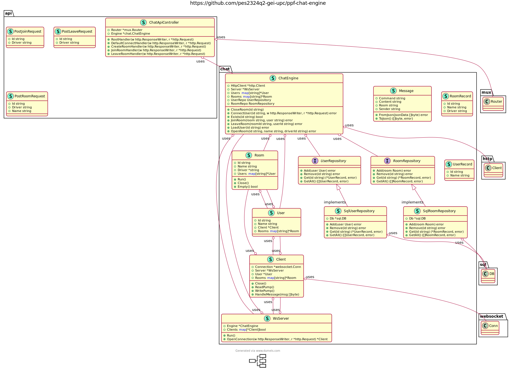

# Chat Engine Design
> Design document for the Chat Engine, contains sequence diagrams, design decisions, etc

- [Chat Engine Design](#chat-engine-design)
  - [Sequence Diagrams](#sequence-diagrams)
    - [**Chat Engine start**](#chat-engine-start)
    - [**Driver creates route**](#driver-creates-route)
    - [**User joins route**](#user-joins-route)
    - [**User leaves route**](#user-leaves-route)
    - [**User connects**](#user-connects)
    - [**User disconnects**](#user-disconnects)
    - [**User sends message**](#user-sends-message)
      - [**User requests joined rooms**](#user-requests-joined-rooms)
      - [**User requests room messages**](#user-requests-room-messages)
      - [**User sends text message**](#user-sends-text-message)
  - [Shcemas](#shcemas)
    - [Message](#message)
      - [Message types](#message-types)
  - [PlantUML](#plantuml)
  - [Design Decisions](#design-decisions)
    - [DD1](#dd1)


**Abreviations:**
- `Chat Engine : CE`

## Sequence Diagrams
### **Chat Engine start**
1. CE starts  
2. Opens Database connection  
3. [Requests all routes from the RouteAPI (DD1)](#dd1)  
    - for each route, CE requests it's users from the UserAPI and stores the users in the database
    - CE creates a chat room for each route and joins the users to the chat room, stores the chat room in the database
5. Opens a WebSocket server
6. Opens a HTTP server and listens for incoming requests

### **Driver creates route**
1. Driver creates a route, App requests RouteAPI to create a route.
2. RouteAPI creates a route and returns the route ID.
3. RouteAPI requests ChatEngine to create a chat room for the route with the route ID and the driver's user ID.
   - If the ACK fails the RouteAPI should retry the request.
6. ChatEngine creates a chat room for the route
7. ChatEngine joins the driver to the chat room
    - If ChatEngine does not have the user info it requests it to the UserAPI
8. ChatEngine sends a msg through WS to notify the driver joined a chat room.

### **User joins route**
1. User joins a route, requests RouteAPI to join the route.
2. RouteAPI joins the user to the route and returns the route ID.
3. RouteAPI requests ChatEngine to join the user to the chat room for the route with the route ID and the user's user ID.
   - If the ACK fails the RouteAPI should retry the request.
5. ChatEngine joins the user to the chat room.
6. ChatEngine sends a msg through WS to notify the user joined a chat room.
7. App adds the room to the cached data.

### **User leaves route**
1. User leaves a route, requests RouteAPI to leave the route.
2. RouteAPI leaves the user from the route.
3. RouteAPI requests ChatEngine to leave the user from the chat room for the route with the route ID and the user's user ID.
   - If the ACK fails the RouteAPI should retry the request.
5. ChatEngine leaves the user from the chat room.
6. ChatEngine sends a msg through WS to notify the user left the chat room.
7. App removes the room from the cached data.

### **User connects**

### **User disconnects**

### **User sends message**
#### **User requests joined rooms**

#### **User requests room messages**

#### **User sends text message**

## Shcemas
### Message
```json
{
    "command": "string",
    "content": "string",
    "room": "string",
    "sender": "string"
}
```
#### Message types
**Get joined rooms**
```json
{
    "command": "GetRooms",
    "content": "",
    "room": "",
    "sender": "<user_id>"
}
```

**Get room messages**
```json
{
    "command": "GetMessages",
    "content": "<datetime ISO 8601>", // optional
    "room": "<room_id>",
    "sender": "<user_id>"
}
```
- if `content` is an empty string, the CE should return all messages in the room in order

**Send message**
```json
{
    "command": "SendMessage",
    "content": "<message>",
    "room": "<room_id>",
    "sender": "<user_id>"
}
```

## PlantUML


## Design Decisions
### DD1
Every time the CE starts it requests all routes and users. While this is not the most efficient way to handle this, it is the simplest way to ensure that the CE has all the data it needs to function. **A trade-off between performance and simplicity.** The CE could be optimized to only request the routes and users that have changed since the last time it started or queue room creation at the RouteAPI.
